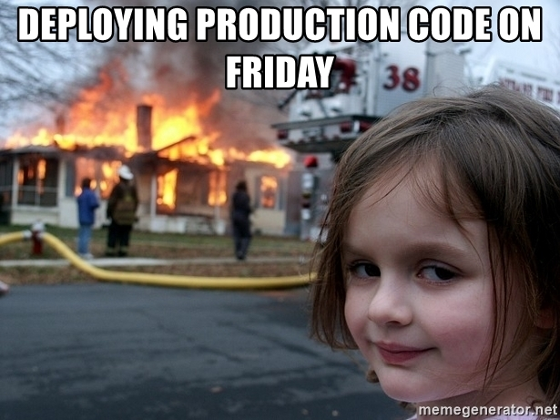

## Hi, I’m kokos and I'm currently 17 years old

### I was born and grew up in Athens of Greece

## How I started coding
I always liked how computers worked but I never had a chance to spend the time until I reached 16 years old and started coding for the first time.

I wanted something hard, so I started with **C++**. I was stuck in a while loop for a few days until I realised that it was too hard for me, so I switched to **Python**.

After a few months and thousands of [LOC][loc_wiki_url], I had mastered **Python** and I decided to go back to **C++** to do the same.

Few months go by and I fell in love with it. The language was so understandable, its syntax so beatiful and it was **FAST**. I always hated when I could't do **EXACTLY** what I wanted in life, when I had something to limit me, this time it was **Python**.

**Python** gives you only one way of doing things while **C++** gives you as many as you let your mind to think of. In **C++** there is always a genius workaround to do what you want.

## My journey with coding
Even though it was harder to find resources for **C++** because it wasn't as popular as **Python**, I liked it and sticked with it. The more I progressed, the harder it was to find people who were willing to help me with difficult problems.

Most of the answers were telling me how **BAD** my code sucked without giving me any advice on how I could improve.

* I've been told **STD** is well-written and optimized (***lol***) by people with many years of experience who know what they are doing
* I've been told I don't know how to optimize and benchmark
* I've been told to use existing resources and not make things on my own

I get that programmers must follow some basic rules for readability and safety, but not trying new things because of being afraid to fail is the **WORST**.

When I open an **C++** **STD** header the only thing I can see is a **MESS**. Templates, types, exceptions, aliases and arguments **EVERYWHERE**.

Even functions that could have been written using a single for-loop and 1 or 2 if-statements are **SO** slow complicated.

## What I like working with
* [Win32][win32_wiki_url]

* Automating tasks using **Python** or **PowerShell**

* I like writing my own little libraries

* I like benchmarking, optimizing and refactoring old crappy code to something new that can be used again in modern projects

* I like creating fast and high-level interfaces in **C**/**C++**

* I love abstracting low-level [API][api_wiki_url]'s using [OOP][oop_wiki_url] with minimal to none performance overhead

* I can learn how to use new languages, [API][api_wiki_url]'s, design-patterns, libraries and frameworks pretty fast

* I want to stay up-to-date with new technologies

* I like writing clean and readable code

* My favorive programming language is **C++** (yes, I'm a monster), but I can easily work with higher-level languages too, like **Python**

* I also like **C#** and have some experience with **HTML**, **CSS**, **JavaScript** and **Ruby**

* I’m currently working on a lot of things and I switch my focus from time, like:
  * Developing an extremely fast **C++** string library with a **TON** of features
  * Creating my own website written in **C++** without the use of any libraries or frameworks (its a pain in the ass)
  * Creating a **C++** **JSON** parsing library
  * Creating my own [Discord][discord_wiki_url] [bot][discord_bot_url]

* I sometimes contribute to open-source projects like [Microsoft sdk-api][microsoft_sdk_api_url] and random libraries I discover

## What I don't like, but can still work with if required
<!-- God forgive me, I'll never say the word again 🙏 -->
* Anything but **PHP**

<!-- URL's -->
[loc_wiki_url]: https://en.wikipedia.org/wiki/Source_lines_of_code
[win32_wiki_url]: https://en.wikipedia.org/wiki/Windows_API
[api_wiki_url]: https://en.wikipedia.org/wiki/API
[oop_wiki_url]: https://en.wikipedia.org/wiki/Object-oriented_programming
[microsoft_sdk_api_url]: https://github.com/MicrosoftDocs/sdk-api
[discord_wiki_url]: https://en.wikipedia.org/wiki/Discord_(software)
[discord_bot_url]: https://discord.com/developers/docs/intro#bots-and-apps
<!-- This page was made by the C++ gang, AKA kokos -->